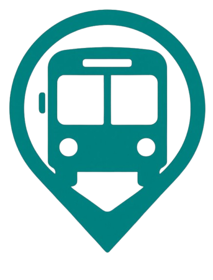
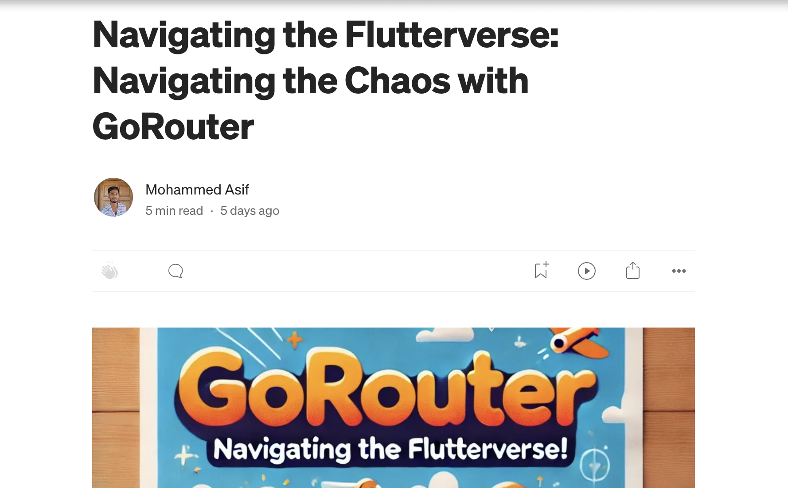

<h1 align="center">Mobile Application developer</h1>

  
 
<h2 align="center">Projects</h2>

  <a href="https://github.com/Asif-Faizal/Social-Circle" target="blank">
    
    <strong>Versace</strong>
  </a>: Real-time chat application powered by gRPC, Node.js and MongoDB on the backend, with a Flutter frontend. It features user registration, login, real-time message streaming, and chat history retrieval using Protocol Buffers.

  <a href="https://github.com/Asif-Faizal/Versace" target="blank">
    
    <strong>Versace</strong>
  </a>: Full fledged Ecommerce Fashion App with product and order managment with payment integration - powered by a Node.js + MongoDB backend, Next.js web frontend and Flutter Mobile app.

  <a href="https://github.com/Asif-Faizal/NextBus" target="blank">
    
    <strong>NextBus</strong>
  </a>: A cross-platform solution for booking unreserved bus tickets and viewing routes — powered by a Node.js + MongoDB backend, Next.js web frontend, and a Flutter mobile app.

  <a href="https://github.com/Asif-Faizal/Contactor" target="blank">
    
    <strong>ContactX</strong>
  </a>: ContactoX is a powerful and fast Flutter plugin designed to fetch contacts directly from the device. Implemented with flutters Method channel for Android and iOS
  <a href="https://pub.dev/packages/contactx" target="_blank"> pub.dev</a>.

  <a href="https://github.com/Asif-Faizal/Informed" target="blank">
    
    <strong>Informed</strong>
  </a>: Informed is a News app built with Flutter's Test-Driven Development (TDD) and Clean Architecture with 49 tests. It focuses on modularity, testability, scalability and maintainability.

 
<h2 align="center">Working On</h2>

  <a href="https://github.com/Asif-Faizal/CryptoScope" target="blank">
    
    <strong>CryptoScope</strong>
  </a>: CryptoScope is a Kotlin Multiplatform Mobile App with separate and different UI for iOS and Android. The app pulls data from a dedicated Node.js API and a MongoDB server.

 
<h2 align="center">Help Me On</h2>

  <a href="https://github.com/Asif-Faizal/True-Face" target="blank">
    
    <strong>EdgeDetectX</strong>
  </a>: EdgeDetectX is a Flutter plugin for real-time edge detection using the device camera, ideal for document scanning and object recognition. 

 
<h2 align="center">Blog Posts</h2>

  
  
  
    

 
<h3 align="center">Connect with me:</h3>

