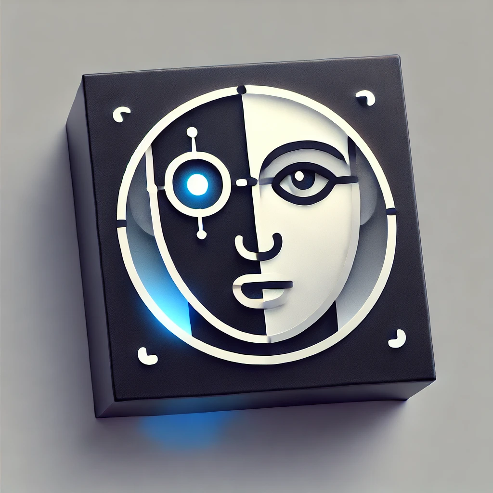
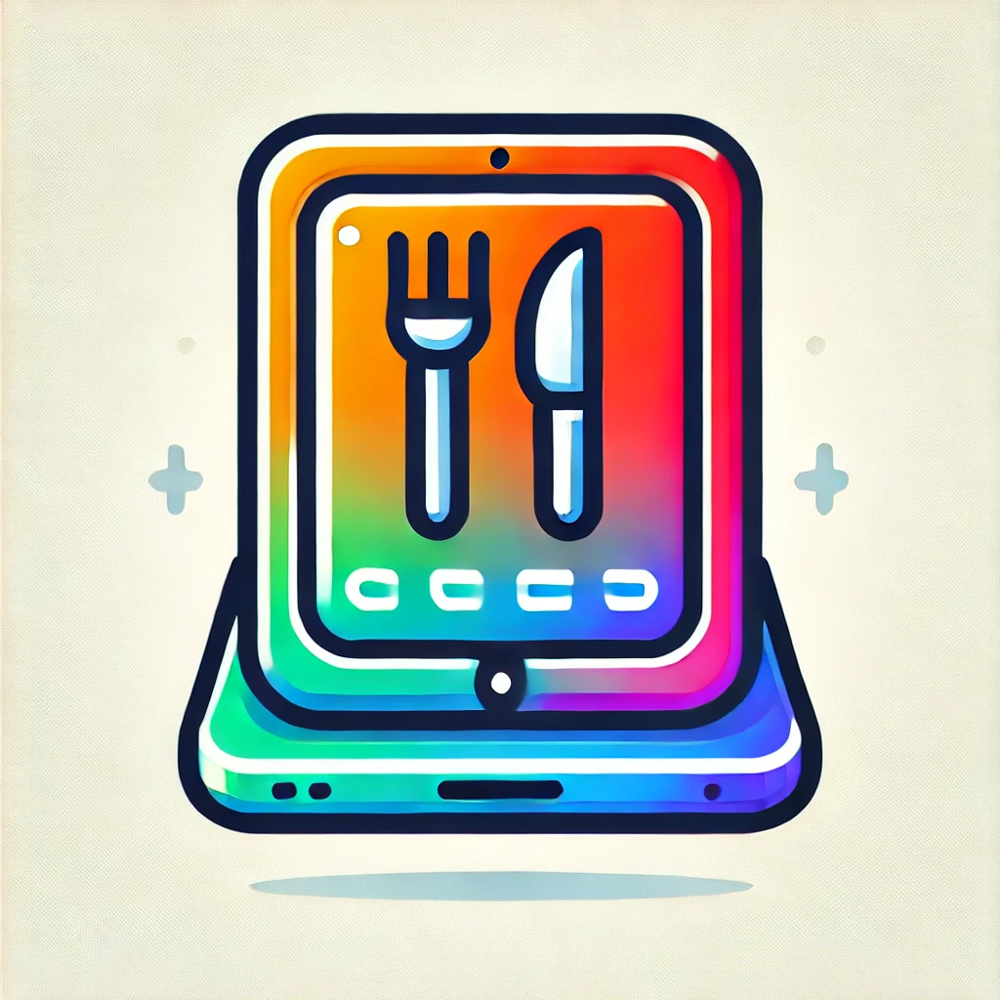
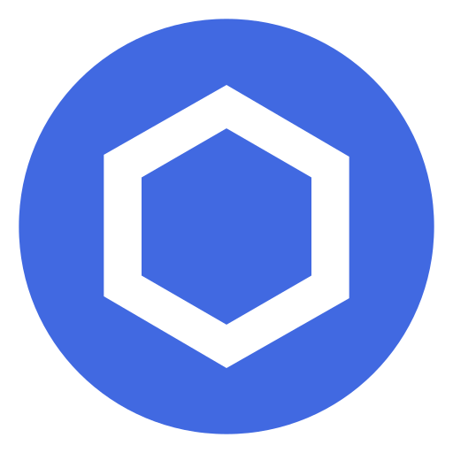
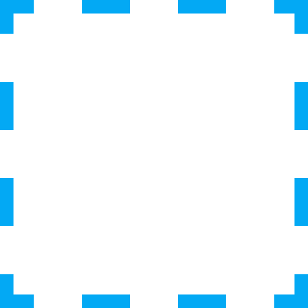
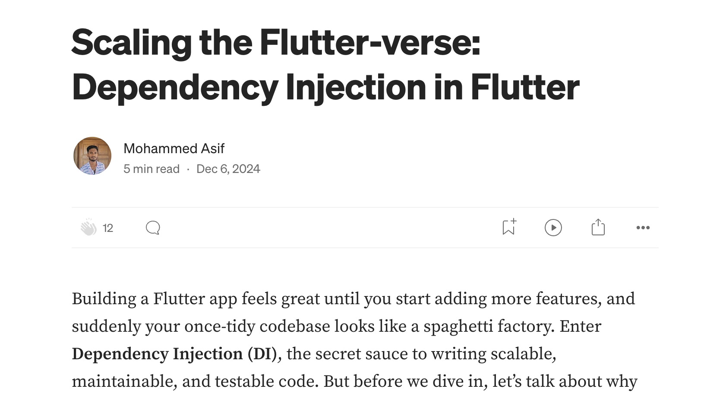
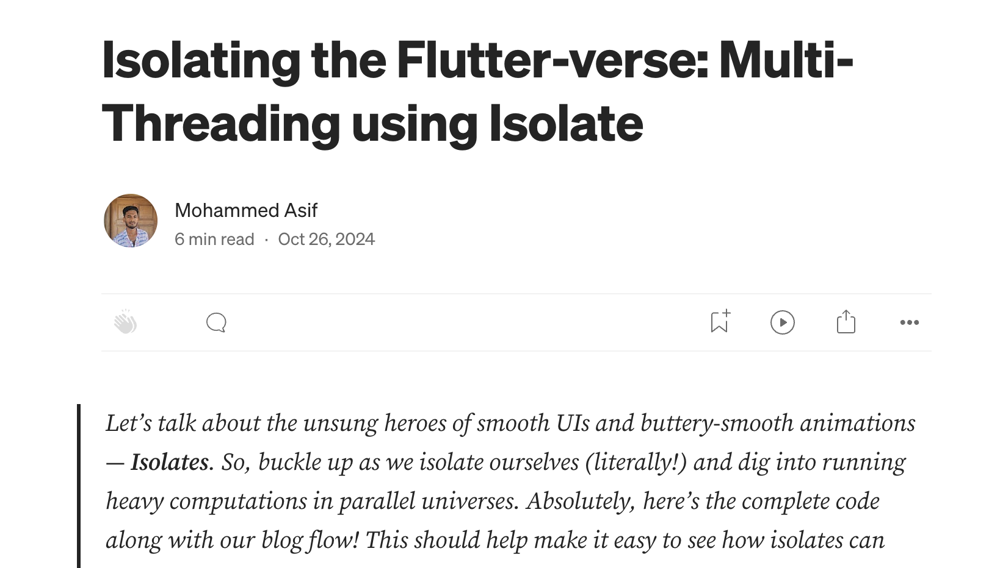
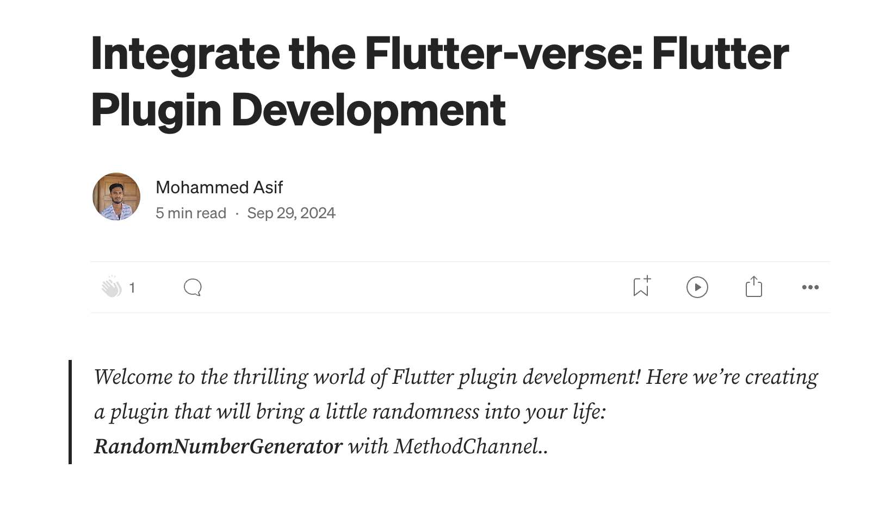

  <h1>Hello World! 🌎, I'm <code>Asif</code></h1>
  <h2>A Mobile Application Developer</h2>
  
<code> Flutter, Android, iOS </code>

- 🔭 Working on [CryptoScope](https://github.com/Asif-Faizal/CryptoScope)  
- 🌱 Learning [Kotlin MultiPlatform Mobile](https://kotlinlang.org/docs/multiplatform.html)
- 👯 Contributing [Flutter-Dotted-Border](https://github.com/ajilo297/Flutter-Dotted-Border)  
- 🤝 Help me on [TrueFace](https://github.com/Asif-Faizal/True-Face)  

## Projects

  <a href="https://github.com/Asif-Faizal/Contactor" target="blank">
    
    <strong>Contactor</strong>
  </a>: Contactor is a powerful and fast Flutter plugin designed to fetch contacts directly from the device. Implemented with flutters Method channel for Android and iOS

  <a href="https://github.com/Asif-Faizal/Blink-Detective" target="blank">
    
    <strong>Blink Detective</strong>
  </a>: Flutter Blink Detection is a Flutter package that provides a controller for detecting faces and blinks using the camera feed and Google's ML Kit.

  <a href="https://github.com/Asif-Faizal/Butler" target="blank">
    
    <strong>Butler</strong>
  </a>: A robust application is built on a dedicated server powered by Node.js and leverages Microsoft SQL Server for efficient database management. Designed with both performance and scalability.

## Working on

  <a href="https://github.com/Asif-Faizal/CryptoScope" target="blank">
    
    <strong>CryptoScope</strong>
  </a>: CryptoScope is a Kotlin Multiplatform Mobile App without separate UI for fetching cryptocurrency prices and market details. The app pulls data from a dedicated Node.js API

## Contributing to

  <a href="https://pub.dev/packages/dotted_border" target="blank">
    
    <strong>Flutter-Dotted-Border</strong>
  </a>: A flutter package to easily added dotted borders around widgets. To use this package, add dotted_border as a dependency in your pubspec.yaml file. Wrap DottedBorder widget around the child widget

## Blogs posts

  
  
  

<h3 align="left">Connect with me:</h3>

