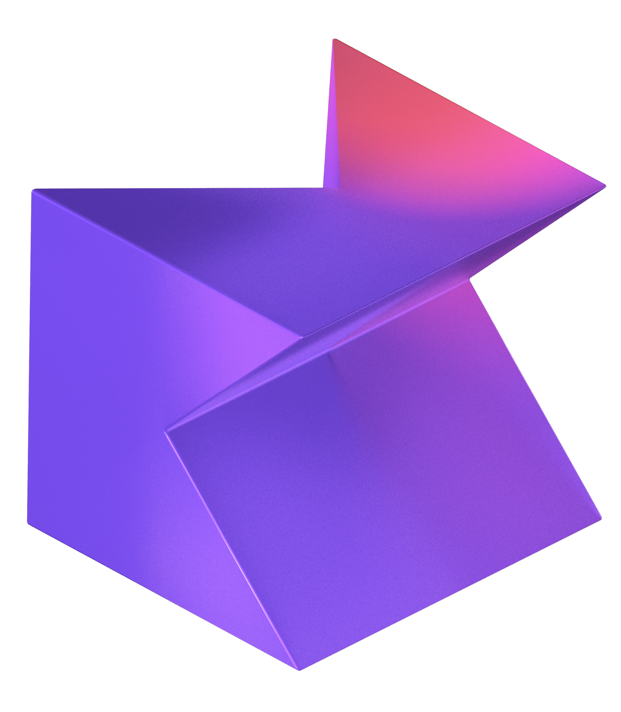

<h1 align="center">Mobile Application developer</h1>

  

  

    
    
    
    
  

 

<h2 align="center">Projects</h2>

  <a href="https://github.com/Asif-Faizal/Contactor" target="blank">
    
    <strong>Contactor</strong>
  </a>: Contactor is a powerful and fast Flutter plugin designed to fetch contacts directly from the device. Implemented with flutters Method channel for Android and iOS

  <a href="https://github.com/Asif-Faizal/Blink-Detective" target="blank">
    
    <strong>Blink Detective</strong>
  </a>: Flutter Blink Detection is a Flutter package that provides a controller for detecting faces and blinks using the camera feed and Google's ML Kit.

  <a href="https://github.com/Asif-Faizal/Butler" target="blank">
    
    <strong>Butler</strong>
  </a>: A robust application is built on a dedicated server powered by Node.js and leverages Microsoft SQL Server for efficient database management. Designed with both performance and scalability.

 
<h2 align="center">Working On</h2>

  <a href="https://github.com/Asif-Faizal/CryptoScope" target="blank">
    
    <strong>CryptoScope</strong>
  </a>: CryptoScope is a Kotlin Multiplatform Mobile App without separate UI for fetching cryptocurrency prices and market details. The app pulls data from a dedicated Node.js API

 
<h2 align="center">Contributing To</h2>

  <a href="https://pub.dev/packages/dotted_border" target="blank">
    
    <strong>Flutter-Dotted-Border</strong>
  </a>: A flutter package to easily added dotted borders around widgets. To use this package, add dotted_border as a dependency in your pubspec.yaml file. Wrap DottedBorder widget around the child widget

 
<h2 align="center">Help Me On</h2>

  <a href="https://github.com/Asif-Faizal/True-Face" target="blank">
    
    <strong>TrueFace</strong>
  </a>: True-Face uses Google ML Kit to verify users by detecting facial landmarks, blinks, and head movements, preventing spoofing with images or videos.

 
<h2 align="center">Blog Posts</h2>

  
  
  

 
<h3 align="center">Connect with me:</h3>

