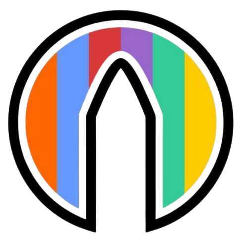

# Mobile Application Developer

## 🚀 Projects

<table style="width: 100%; table-layout: fixed;">
<tr>
<td width="25%" align="center" style="padding: 10px; vertical-align: top;">
   
  <b><a href="https://github.com/Asif-Faizal/Social-Circle">Social Circle</a></b> 
  <small><b>[Full-Stack Mobile]</b></small> 
  <small>Real-time chat application powered by gRPC, Node.js, and MongoDB with Flutter.</small>
</td>
<td width="25%" align="center" style="padding: 10px; vertical-align: top;">
   
  <b><a href="https://github.com/Asif-Faizal/DoodleDome">Doodle-Dome</a></b> 
  <small><b>[Backend]</b></small> 
  <small>School-based art competition platform for managing contests, schools, students, and registrations.</small>
</td>
<td width="25%" align="center" style="padding: 10px; vertical-align: top;">
   
  <b><a href="https://github.com/Asif-Faizal/Gommerce">Gommerce</a></b> 
  <small><b>[Backend]</b></small> 
  <small>Fast modular eCommerce API with Golang, JWT authentication, MySQL integration.</small>
</td>
<td width="25%" align="center" style="padding: 10px; vertical-align: top;">
   
  <b><a href="https://github.com/Asif-Faizal/Contactor">ContactX</a></b> 
  <small><b>[Flutter Plugin]</b></small> 
  <small>High-performance Flutter plugin for fetching device contacts. Available on <a href="https://pub.dev/packages/contactx">pub.dev</a>.</small>
</td>
</tr>
<tr>
<td width="25%" align="center" style="padding: 10px; vertical-align: top;">
   
  <b><a href="https://github.com/Asif-Faizal/Informed">Informed</a></b> 
  <small><b>[Mobile App]</b></small> 
  <small>News app built with Flutter TDD and Clean Architecture (49 tests). Focuses on modularity and maintainability.</small>
</td>
<td width="25%" align="center" style="padding: 10px; vertical-align: top;">
  <!-- Empty cell -->
</td>
<td width="25%" align="center" style="padding: 10px; vertical-align: top;">
  <!-- Empty cell -->
</td>
<td width="25%" align="center" style="padding: 10px; vertical-align: top;">
  <!-- Empty cell -->
</td>
</tr>
</table>

## 🔥 Currently Working On

<table style="width: 100%; table-layout: fixed;">
<tr>
<td width="25%" align="center" style="padding: 10px; vertical-align: top;">
   
  <b><a href="https://github.com/Asif-Faizal/Versace">Versace</a></b> 
  <small><b>[Full-Stack Mobile]</b></small> 
  <small>Fashion ecommerce app with product/order management and payments using Node.js + MongoDB + Flutter.</small>
</td>
<td width="25%" align="center" style="padding: 10px; vertical-align: top;">
   
  <b><a href="https://github.com/Asif-Faizal/CryptoScope">CryptoScope</a></b> 
  <small><b>[Mobile App]</b></small> 
  <small>Kotlin Multiplatform Mobile App with platform-specific UIs pulling data from Node.js API + MongoDB.</small>
</td>
<td width="25%" align="center" style="padding: 10px; vertical-align: top;">
  <!-- Empty cell -->
</td>
<td width="25%" align="center" style="padding: 10px; vertical-align: top;">
  <!-- Empty cell -->
</td>
</tr>
</table>

## 🤝 Help Me On

<table style="width: 100%; table-layout: fixed;">
<tr>
<td width="25%" align="center" style="padding: 10px; vertical-align: top;">
   
  <b><a href="https://github.com/Asif-Faizal/True-Face">EdgeDetectX</a></b> 
  <small><b>[Flutter Plugin]</b></small> 
  <small>Real-time edge detection plugin for document scanning and object recognition using device camera.</small>
</td>
<td width="25%" align="center" style="padding: 10px; vertical-align: top;">
  <!-- Empty cell -->
</td>
<td width="25%" align="center" style="padding: 10px; vertical-align: top;">
  <!-- Empty cell -->
</td>
<td width="25%" align="center" style="padding: 10px; vertical-align: top;">
  <!-- Empty cell -->
</td>
</tr>
</table>

## 📝 Blog Posts

| [Flutter Plugin Development](https://medium.com/@moh.asif/enter-the-flutter-verse-flutter-plugin-development-c348e1e8c49c) | [Dependency Injection in Flutter](https://medium.com/@moh.asif/scaling-the-flutter-verse-dependency-injection-in-flutter-16ac576ba1f1) |
|:---:|:---:|
|  |  |

| [Multi-threading using Isolate](https://medium.com/@moh.asif/isolating-the-flutter-verse-multi-threading-using-isolate-3eadaf6b2321) | [Navigating with GoRouter](https://medium.com/@moh.asif/navigating-the-flutterverse-navigating-the-chaos-with-gorouter-f1ded2844738) |
|:---:|:---:|
|  |  |

